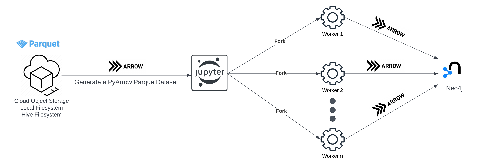

# Data ingestion for Neo4j GDS (via Apache Arrow) 🏹
This project contains python notebooks that load data into a Neo4j database or in-memory graph projection
from large datasets consisted of **Apache Parquet** files.

## Managing large datasets with Apache Arrow

One of the main capabilities of Apache Arrow is the ability to deal with <strong>memory-mapped files</strong>,<br>
this allows Arrow to read datasets that are bigger than the available RAM without incurring any additional memory cost.
<br>

With the PyArrow ParquetDataset module we can create a dataset of memory-map parquet files, it can then be fragmented 
and processed in batches.
    
In addition to `local` & `hdfs` storage, PyArrow also supports cloud object storage such as:

* Amazon Simple Storage (S3)
* Google Cloud Storage (GCS)
* Microsoft Azure Blob Storage


## Neo4j GDS Arrow Installation

Please see the [Apache Arrow](https://neo4j.com/docs/graph-data-science/current/installation/installation-apache-arrow/) 
installation instructions and requirements in the Neo4j GDS documentation.

## Notebooks
* `neo4j_arrow_create_database.ipynb`: Used to create a Neo4j database from a PyArrow ParquetDataset
* `neo4j_arrow_create_projection.ipynb`:Used to create a Neo4j in-memory graph projection from a PyArrow ParquetDataset

## Configuration

The configuration is defined in the `config.yaml` file with the below parameters:
```yaml
neo4j: 
 host: 'your-neo4j-host-ip'
 port: 8491
 user: 'your-neo4j-username'
 password: 'your-password'
 tls: False
 concurrency: 10
 database: 'neo4j'
 #projection: 'mygraph'
   
dataset:
 node_parquet_files_uri: 'gs://your-bucket/pqdataset-projection/nodes'
 relationship_parquet_files_uri: 'gs://your-bucket/pqdataset-projection/relationships'

worker:
 concurrency: 10
 arrow_table_size: 1_000_000
```
* `host`: Server address of your Neo4j installation
* `port`: Port that the arrow flight server listens for incoming connections
* `user`: Username of neo4j user
* `password`: Password for neo4j user
* `tls`: Sets the encryption between the client and Neo4j server, for more information please see [Arrow Encryption](https://neo4j.com/docs/graph-data-science/current/installation/installation-apache-arrow/#_encryption)
* `concurrency`: Number of threads to use for the database/projection creation process
* `database`: The name of the import process and the resulting database name
* `projection`: The name of the resulting in-memory graph in the graph catalog, **(Required only when creating an in-memory projection)**
* `node_parquet_files_uri`: Node parquet files location uri used by pyarrow to create the dataset (Required, and it must contain the **nodes** string)
* `relationship_parquet_files_uri`: Relationship parquet files location uri used by pyarrow to create the dataset (Required, and it must contain the **relationships** string)
* `concurrency`: Number of workers used by the notebook to process our datasets **(Recommended that it matches the concurrency set above for our Neo4j process)**
* `arrow_table_size`: Controls the arrow table size sent to Neo4j by our workers

## Parquet dataset structure
* The PyArrow ParquetDataset module parses the uri to determine the filesystem, `s3`, `gcs`, `hdfs`, `local` etc.
* To manage your datasets easier, especially large ones. It is recommended to follow the below subfolder structure:
  * Under your required **nodes** directory have a subdirectory for each node label, with its parquet files
  * Under your required **relationships** directory have a subdirectory for each relationship type with its parquet files
* PyArrow will automatically detect parquet files located in sub-directories
```
├── parquet-dataset-root-folder
│   ├── nodes
│   │   ├── label1
│   │   │   ├── label1-00000.parquet
│   │   │   ├── label1-00001.parquet
│   │   │   ├── label1-00002.parquet
│   │   ├── label2
│   │   │   ├── label2-00000.parquet
│   │   │   ├── label2-00001.parquet
│   │   │   ├── label2-00002.parquet
│   ├── relationships
│   │   ├── type1
│   │   │   ├── type1-00000.parquet
│   │   │   ├── type1-00001.parquet
│   │   │   ├── type1-00002.parquet
│   │   ├── type2
│   │   │   ├── type2-00000.parquet
│   │   │   ├── type2-00001.parquet
│   │   │   ├── type2-00002.parquet
```